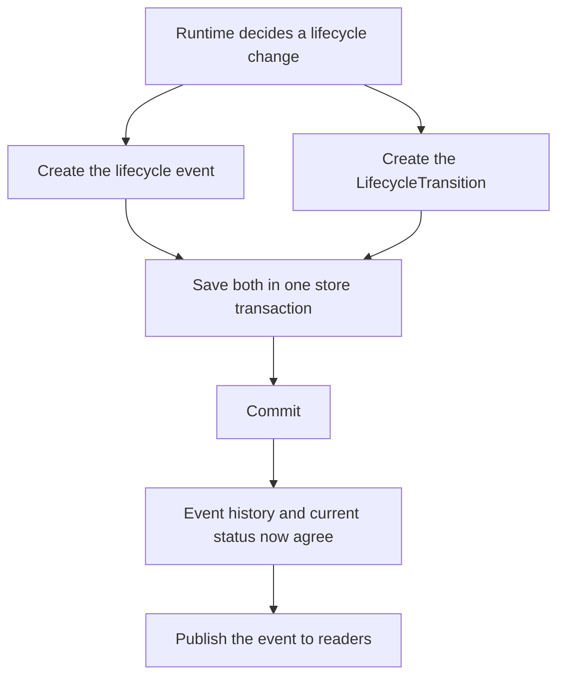

# OperationCore

OperationCore is a durable asynchronous operation runtime for Python. It gives
long-running application work a consistent lifecycle, persistent task records,
ordered events, live event streaming, retries, cancellation, restart recovery,
and replaceable storage. It generalizes the operation machinery developed for
[RAVEN](https://pypi.org/project/noomexai-raven/) into an application-independent
package.

The public workflow is deliberately small:

```python
await core.manager.start()
operation = await core.manager.create("document.import")
task = await operation.run("document.import", worker)
result = await task.result()
```

Each operation owns one event stream. The runtime records what happened while
the application receives ordinary Python objects and async iterators.

## Guide contents

- [Origin and relationship to RAVEN](#origin-and-relationship-to-raven)
- [What problem it solves](#what-problem-it-solves)
- [Mental model](#mental-model)
- [Lifecycle](#lifecycle)
- [Installation](#installation)
- [Quick start](#quick-start)
- [Creating and running an operation](#creating-and-running-an-operation)
- [Events and live streaming](#events-and-live-streaming)
- [Errors and custom error codes](#errors-and-custom-error-codes)
- [Child tasks](#child-tasks)
- [Retry policy](#retry-policy)
- [Cancellation](#cancellation)
- [Reading durable records](#reading-durable-records)
- [Restart recovery](#restart-recovery)
- [Synchronization and SQLite WAL](#synchronization-and-sqlite-wal)
- [Retention cleanup](#retention-cleanup)
- [Settings](#settings)
- [Default SQLite store](#default-sqlite-store)
- [Custom stores](#custom-stores)
- [Internal consistency model](#internal-consistency-model)
- [Differences from RAVEN](#why-operationcore-differs-from-ravens-runtime)
- [API summaries](#manager-api-summary)
- [Shutdown and ownership](#shutdown-and-ownership)
- [Current boundaries](#current-boundaries)

## Origin and relationship to RAVEN

OperationCore is a standalone generalization of the operation engine developed
for [RAVEN](https://pypi.org/project/noomexai-raven/). RAVEN uses operations for
work such as ingestion, reconstruction, chat, knowledge management, retrieval,
and model activity. Its operation runtime proved the central model:

- An operation is the durable identity of one unit of work.
- Every operation owns an ordered event stream.
- A root task executes the operation, with optional child tasks beneath it.
- Lifecycle events, current status, retries, cancellation, and recovery are
  coordinated by an operation manager.
- SQLite preserves operations, tasks, and events across process restarts.

Those mechanics remain at the center of OperationCore. The difference is that
OperationCore contains no RAVEN domain vocabulary or RAVEN application logic.
Applications supply their own operation names, workers, event types, error
codes, retry policy, storage location, and, when needed, store implementation.

OperationCore does not depend on RAVEN. RAVEN can instead use OperationCore as
its generic operation runtime by supplying RAVEN-specific event and error
catalogs and workers.

## What problem it solves

An ordinary coroutine tells you whether one call returned or raised. A
long-running application usually needs more:

- A stable identifier that can be returned to a client immediately.
- Progress events while the worker is still running.
- Durable history that can be replayed after reconnecting.
- Current operation and task status without replaying the entire history.
- Cancellation that records a terminal outcome.
- Retry limits and durable retry input.
- Recovery when a previous process ended with unfinished work.
- A bounded in-memory cache without losing persisted records.
- A storage interface that is not tied to SQLite.

OperationCore supplies those mechanisms while leaving domain work inside the
application.

## Mental model

```text
OperationCore
└── OperationManager
    ├── OperationStore
    ├── synchronization service
    ├── optional cleanup service
    └── Operation
        ├── EventStream
        └── OperationTask
            └── optional child OperationTask objects
```

### `OperationCore`

`OperationCore` is the composition root. It resolves settings, event and error
catalogs, creates the default SQLite store when a custom store is not supplied,
constructs the manager, and exposes everything through `core.manager`.

### `OperationManager`

The manager owns shared runtime resources. It creates and reloads operations,
starts synchronization, performs recovery, lists durable records, manages the
finished-operation cache, coordinates cleanup, and closes the store.

### `Operation`

An operation is one durable unit of work. It has a UUID, name, lifecycle
status, one event stream, and, after execution begins, a root task with optional
child tasks.

### `OperationTask`

A task is one worker invocation inside an operation. The first task is the root
task. Calls to `operation.run()` while the root operation is running create
child tasks.

### `EventStream`

The event stream stores lifecycle and application events in operation-local
order. It provides historical reads and history followed by live delivery
through one async iterator.

### `OperationStore`

The store persists operation projections, task projections, retry lineage, and
the event journal. `SQLiteOperationStore` is the default. Applications can
supply another object that satisfies the `OperationStore` protocol.

## Lifecycle

Operations and tasks use the same fixed lifecycle statuses:

```text
QUEUED → RUNNING → COMPLETED
QUEUED or RUNNING → FAILED
QUEUED or RUNNING → CANCELLED
```

The values are available through `LifecycleStatus`:

| Status | Meaning |
|---|---|
| `QUEUED` | Persisted but not yet executing. |
| `RUNNING` | Worker execution has started. |
| `COMPLETED` | Worker and required child work completed successfully. |
| `FAILED` | Worker execution or required child work failed. |
| `CANCELLED` | Cancellation ended the task or operation. |

Lifecycle status is intentionally fixed because it drives runtime behavior and
database projections. Application-specific concepts belong in event types,
error codes, operation names, and event data.

## Installation

```bash
pip install noomexai-operationcore
```

## Quick start

```python
import asyncio

from operationcore import Event, EventType, OperationCore


class ApplicationEventType(EventType):
    PROGRESS = "document.import.progress"


async def import_document(operation):
    for progress in range(10, 101, 10):
        await asyncio.sleep(1)
        await operation.publish(
            Event(
                type=ApplicationEventType.PROGRESS,
                data={"progress": progress},
            )
        )

    return {"status": "complete", "progress": 100}


async def stream_events(operation):
    async for event in operation.events():
        if event.type == ApplicationEventType.PROGRESS:
            print(f"stream: progress={event.data['progress']}%")
        else:
            print(f"stream: {event.type}")


async def main() -> None:
    core = OperationCore(
        "operation_store",
        event_type=ApplicationEventType,
    )

    try:
        await core.manager.start()
        operation = await core.manager.create("document.import")

        event_consumer = asyncio.create_task(stream_events(operation))
        task = await operation.run("document.import", import_document)

        result = await task.result()
        await event_consumer
        print("task.result():", result)
    finally:
        await core.manager.close()


asyncio.run(main())
```

The worker runs for about ten seconds. Every second it publishes another ten
percent of progress. `operation.events()` first replays the queued event that
was already stored, then continues yielding new lifecycle and progress events
as they are committed. `task.result()` waits for the worker and its operation to
finish, then returns the worker's result.

> [!IMPORTANT]
> Streaming events does not replace `await task.result()`. The event stream
> reports progress and lifecycle history; `task.result()` waits until the task
> is complete and returns its value or raises its error. A live consumer can run
> concurrently with `task.result()`, as shown above. Before starting dependent
> work or opening a subsequent stream that depends on this task, applications
> will usually want to await `task.result()` first.

The output follows this sequence:

```text
stream: operation.lifecycle.queued
stream: operation.lifecycle.task.queued
stream: operation.lifecycle.started
stream: operation.lifecycle.task.started
stream: progress=10%
stream: progress=20%
stream: progress=30%
stream: progress=40%
stream: progress=50%
stream: progress=60%
stream: progress=70%
stream: progress=80%
stream: progress=90%
stream: progress=100%
stream: operation.lifecycle.task.completed
stream: operation.lifecycle.completed
task.result(): {'status': 'complete', 'progress': 100}
```

The default store is created at:

```text
operation_store/operations.sqlite3
```

If `storage_dir` is omitted, the default directory is `operation_store` under
the current working directory.

### Constructing `OperationCore`

The constructor is:

```python
OperationCore(
    storage_dir=None,
    *,
    event_type=None,
    error_code=None,
    settings=None,
    store=None,
    enable_startup_cleanup=False,
)
```

| Argument | Purpose |
|---|---|
| `storage_dir` | Directory for the default `operations.sqlite3` database. |
| `event_type` | `EventType` subclass containing lifecycle and application events. |
| `error_code` | `ErrorCode` subclass containing runtime and application errors. |
| `settings` | Immutable `OperationSettings` instance. |
| `store` | Custom `OperationStore` implementation. |
| `enable_startup_cleanup` | Run one retention cleanup pass during manager startup. Defaults to `False`. |

`storage_dir` and `store` are mutually exclusive. With the default store,
`core.storage_dir` and `core.database_path` contain resolved paths. They are
`None` when a custom store is supplied.

The manager can start lazily on its first operation, but applications should
call `await core.manager.start()` explicitly during startup. This initializes
the store and synchronization service, and it runs configured startup cleanup
before application work begins. The examples in this guide follow that
practice.

## Creating and running an operation

Create a queued operation through the manager:

```python
await core.manager.start()
operation = await core.manager.create("document.import")
```

Creation assigns a UUID, stores the initial projection, and writes the queued
lifecycle event. It does not start a worker.

Run the root worker:

```python
task = await operation.run("document.import", import_document)
```

The first task name must match the operation name. `run()` persists the task
and its queued lifecycle event before scheduling execution. It returns an
`OperationTask` handle without waiting for the worker to finish.

A successful root invocation normally produces this order:

```text
operation.lifecycle.queued
operation.lifecycle.task.queued
operation.lifecycle.started
operation.lifecycle.task.started
...application events...
operation.lifecycle.task.completed
operation.lifecycle.completed
```

Failure and cancellation replace the two terminal `completed` events with the
corresponding `failed` or `cancelled` events.

Wait for and retrieve the result:

```python
result = await task.result()
```

`task.result()` returns the native worker result or raises the worker's native
exception while the process still has that task object. Cancellation is
reported as an `OperationError` using the configured cancellation code.

Useful live properties include:

```python
operation.operation_id
operation.name
operation.status
operation.is_finished
operation.created_at
operation.started_at
operation.finished_at
operation.result
operation.error

task.task_id
task.name
task.status
task.is_finished
task.is_root
task.parent_task_id
task.attempt
task.retry_policy
task.retry_input
```

Worker results are held in memory. OperationCore persists lifecycle, errors,
retry metadata, tasks, and events; it does not persist arbitrary worker return
values. A completed operation reloaded after restart therefore has its durable
status and history but not its original Python result object.

## Events and live streaming

Start an event consumer before running the worker:

```python
async def consume(operation) -> None:
    async for event in operation.events():
        print(event.event_id, event.type, event.data)


await core.manager.start()
operation = await core.manager.create("document.import")
consumer = asyncio.create_task(consume(operation))

task = await operation.run("document.import", import_document)
result = await task.result()
await consumer
```

The iterator replays retained history first, continues with committed live
events without changing APIs, and ends after the final operation event.

### Event cursors and `last_event_id`

Every committed event receives an `event_id`. IDs begin at `1` and increase
inside one operation. They are local to that operation and are not global
identifiers.

`last_event_id` is an application-owned cursor: it is the ID of the most recent
event that a particular consumer processed successfully. It is not a special
OperationCore variable. Start at `0` when the consumer has not processed any
events, then update it after handling each event:

```python
last_event_id = 0

async for event in operation.events(after_event_id=last_event_id):
    handle(event)
    assert event.event_id is not None
    last_event_id = event.event_id
```

`after_event_id` is exclusive. Passing `12` starts with event `13` when it
exists; event `12` is not repeated. A cursor greater than the newest stored
event is rejected with `OPERATION_RUNTIME_EVENT_HISTORY_GAP` rather than treated
as a request to wait for that future ID. Update the cursor only after processing
succeeds so that an interrupted consumer can receive an unfinished event again.
An application that needs to resume after a reconnect or process restart should
save its consumer cursor in its own durable state.

`OperationRecord.last_event_id` has a different role: it is the ID of the newest
event currently stored for the operation. It describes the stream's durable
position rather than how far a particular consumer has read.

Read a bounded historical page:

```python
events = await operation.read_events(
    after_event_id=last_event_id,
    limit=100,
)
```

The manager provides equivalent ID-based access:

```python
await core.manager.start()
events = await core.manager.read_events(
    operation_id,
    after_event_id=last_event_id,
    limit=100,
)

async for event in core.manager.events(
    operation_id,
    after_event_id=last_event_id,
):
    ...
```

Application workers may publish ordinary events:

```python
await operation.publish(
    Event(
        type=ApplicationEventType.PROGRESS,
        data={"percent": 50},
    )
)
```

The active task context automatically supplies `operation_id`, `task_id`, and
`task_name` where appropriate. Workers cannot publish final events; terminal
lifecycle events belong to the runtime.

`Event` is a frozen Pydantic model with these fields:

| Field | Type | Purpose |
|---|---|---|
| `type` | `str` | Lifecycle or application event name. |
| `data` | `dict[str, Any]` | Event payload. |
| `operation_id` | `UUID \| None` | Assigned operation identity. |
| `task_id` | `UUID \| None` | Correlated task identity. |
| `task_name` | `str \| None` | Correlated task name. |
| `event_id` | `int \| None` | Operation-local durable sequence number. |
| `timestamp` | `datetime` | Event time; defaults to the current UTC time. |
| `is_final` | `bool` | Whether this closes the operation stream. |

With the default SQLite store, `data` must contain JSON-serializable values.

## Built-in lifecycle event types

`EventType` contains the lifecycle vocabulary required by the runtime:

| Attribute | Stored value |
|---|---|
| `OPERATION_LIFECYCLE_QUEUED` | `operation.lifecycle.queued` |
| `OPERATION_LIFECYCLE_STARTED` | `operation.lifecycle.started` |
| `OPERATION_LIFECYCLE_COMPLETED` | `operation.lifecycle.completed` |
| `OPERATION_LIFECYCLE_FAILED` | `operation.lifecycle.failed` |
| `OPERATION_LIFECYCLE_CANCELLED` | `operation.lifecycle.cancelled` |
| `OPERATION_LIFECYCLE_TASK_QUEUED` | `operation.lifecycle.task.queued` |
| `OPERATION_LIFECYCLE_TASK_STARTED` | `operation.lifecycle.task.started` |
| `OPERATION_LIFECYCLE_TASK_COMPLETED` | `operation.lifecycle.task.completed` |
| `OPERATION_LIFECYCLE_TASK_FAILED` | `operation.lifecycle.task.failed` |
| `OPERATION_LIFECYCLE_TASK_CANCELLED` | `operation.lifecycle.task.cancelled` |

Inspect the available values without relying on editor completion:

```python
print(EventType.to_dict())
```

## Custom event types

Extend `EventType` with application events:

```python
class ApplicationEventType(EventType):
    DOCUMENT_PROGRESS = "document.import.progress"
    DOCUMENT_INDEXED = "document.import.indexed"
```

Pass the class to the core:

```python
core = OperationCore(
    "operation_store",
    event_type=ApplicationEventType,
)
```

Subclasses cannot override the runtime-wide built-in lifecycle attributes in
their class definitions. This keeps operation behavior and persisted lifecycle
meaning stable. Applications can add any uppercase string fields they need.

```python
ApplicationEventType.to_dict()
```

returns both the inherited lifecycle events and the application additions.
Dot-separated values are the package convention for events, but custom values
are not forced to follow that convention.

Catalogs belong to one core instance and are passed through its manager,
operations, tasks, and streams. Stores receive concrete event strings and error
payloads rather than the event catalog itself. The default SQLite store also
receives the configured error catalog for its own runtime errors. A custom store
is configured by the application that creates it. Separate `OperationCore`
instances can use different catalog subclasses in the same process without
changing global state.

## Errors and custom error codes

Expected public failures use `OperationError`:

```python
from operationcore import ErrorCode, OperationCore, OperationError


class ApplicationErrorCode(ErrorCode):
    SOURCE_UNAVAILABLE = "document-error:source-unavailable"
    PARSING_FAILED = "document-error:parsing-failed"


core = OperationCore(
    "operation_store",
    error_code=ApplicationErrorCode,
)


raise OperationError(
    ApplicationErrorCode.SOURCE_UNAVAILABLE,
    "The document source is temporarily unavailable.",
    details={"document_id": "doc-123"},
)
```

`OperationError` exposes:

```python
error.code
error.message
error.details
error.as_payload()
```

Expected `OperationError` values retain their safe code, message, and details
in durable event and operation error payloads. Unexpected exceptions are
persisted with `OPERATION_RUNTIME_INTERNAL_ERROR` and a generic message so
private exception details are not exposed through storage.

With the default SQLite store, custom `details` values must also be JSON
serializable because they are written into task and operation error payloads.

Inspect built-in runtime codes or a complete custom catalog:

```python
ErrorCode.to_dict()
ApplicationErrorCode.to_dict()
```

Subclasses cannot override built-in runtime fields in their class definitions.
Custom fields and their string formats are unrestricted. Colon-separated values
with hyphenated segments are the package convention for errors, not a validation
rule.

### Built-in runtime error codes

| Attribute | Stored value |
|---|---|
| `OPERATION_RUNTIME_INVALID_NAME` | `operation-runtime:invalid-name` |
| `OPERATION_RUNTIME_NOT_FOUND` | `operation-runtime:not-found` |
| `OPERATION_RUNTIME_CANCELLED` | `operation-runtime:cancelled` |
| `OPERATION_RUNTIME_INTERRUPTED` | `operation-runtime:interrupted` |
| `OPERATION_RUNTIME_FINISHED` | `operation-runtime:finished` |
| `OPERATION_RUNTIME_INVALID_ID` | `operation-runtime:invalid-id` |
| `OPERATION_RUNTIME_INVALID_STATUS` | `operation-runtime:invalid-status` |
| `OPERATION_RUNTIME_INVALID_PAGE_SIZE` | `operation-runtime:invalid-page-size` |
| `OPERATION_RUNTIME_INVALID_CACHE_SIZE` | `operation-runtime:invalid-cache-size` |
| `OPERATION_RUNTIME_MANAGER_CLOSED` | `operation-runtime:manager:closed` |
| `OPERATION_RUNTIME_TASK_NOT_FOUND` | `operation-runtime:task:not-found` |
| `OPERATION_RUNTIME_TASK_NOT_RETRYABLE` | `operation-runtime:task:not-retryable` |
| `OPERATION_RUNTIME_TASK_ALREADY_RETRIED` | `operation-runtime:task:already-retried` |
| `OPERATION_RUNTIME_INVALID_RETRY_INPUT` | `operation-runtime:retry-input:invalid` |
| `OPERATION_RUNTIME_EVENT_STREAM_CLOSED` | `operation-runtime:event-stream:closed` |
| `OPERATION_RUNTIME_EVENT_STREAM_FINISHED` | `operation-runtime:event-stream:finished` |
| `OPERATION_RUNTIME_INVALID_EVENT_CURSOR` | `operation-runtime:event:invalid-cursor` |
| `OPERATION_RUNTIME_INVALID_EVENT_PAGE_SIZE` | `operation-runtime:event:invalid-page-size` |
| `OPERATION_RUNTIME_EVENT_HISTORY_GAP` | `operation-runtime:event:history-gap` |
| `OPERATION_RUNTIME_SYNC_FAILED` | `operation-runtime:sync:failed` |
| `OPERATION_RUNTIME_DATABASE_FAILED` | `operation-runtime:database:failed` |
| `OPERATION_RUNTIME_DATABASE_IN_USE` | `operation-runtime:database:in-use` |
| `OPERATION_RUNTIME_DATABASE_CORRUPTED` | `operation-runtime:database:corrupted` |
| `OPERATION_RUNTIME_UNSUPPORTED_DATABASE_VERSION` | `operation-runtime:database:unsupported-version` |
| `OPERATION_RUNTIME_INVALID_SYNC_INTERVAL` | `operation-runtime:sync:invalid-interval` |
| `OPERATION_RUNTIME_INVALID_RETENTION` | `operation-runtime:retention:invalid` |
| `OPERATION_RUNTIME_INVALID_CLEANUP_BATCH_SIZE` | `operation-runtime:cleanup:invalid-batch-size` |
| `OPERATION_RUNTIME_INTERNAL_ERROR` | `operation-runtime:internal-error` |

## Child tasks

A running root worker can create child tasks through the same operation:

```python
async def process_page(operation):
    await operation.publish(
        Event(
            type=ApplicationEventType.DOCUMENT_PROGRESS,
            data={"page": 1},
        )
    )
    return "page-1"


async def import_document(operation):
    child = await operation.run("document.process-page", process_page)
    page = await child.result()
    return {"processed": [page]}
```

Child tasks receive their own task IDs and lifecycle events while sharing the
operation event stream. Nested event correlation records the active parent
task. `child.events()` yields events belonging to that child and its
descendants.

The root operation waits for child tasks before it reaches a terminal state.
If a child fails and its result was never observed, the root operation fails.
Calling `await child.result()` marks the failure as observed, allowing the root
worker to handle it deliberately.

## Retry policy

Retry behavior is selected per task invocation:

```python
from operationcore import RetryPolicy


policy = RetryPolicy(
    max_attempts=3,
    retryable_error_codes=frozenset(
        {ApplicationErrorCode.SOURCE_UNAVAILABLE}
    ),
)

task = await operation.run(
    "document.import",
    import_document,
    retry_policy=policy,
    retry_input={"document_id": "doc-123"},
)
```

`retry_input` must be a JSON-serializable dictionary. It stores the durable
information the application needs to reconstruct a later worker invocation.
Python callables are never persisted. Retry input is accepted only when the
selected policy is enabled: it must allow more than one attempt and contain at
least one retryable error code.

A failed task is retryable only when all of these are true:

- The policy has more than one allowed attempt.
- The policy contains at least one retryable error code.
- The task has JSON retry input.
- The task failed with a code included in the policy.
- The attempt limit has not been reached.
- No direct retry task has already claimed it.

Find retryable records:

```python
await core.manager.start()
records = await core.manager.list_retryable_tasks()
failed = records[0]
```

Create a new operation and retry from the durable record:

```python
await core.manager.start()
retry_operation = await core.manager.create(failed.name)
retry_task = await retry_operation.run(
    failed.name,
    import_document,
    retry_of=failed,
)
result = await retry_task.result()
```

The retry inherits the original policy and saved retry input. An explicitly
provided `retry_input` may replace the saved input, but the policy cannot be
changed. The task record stores its attempt number, source operation ID, and
source task ID. A unique store constraint permits only one direct successor for
each retried task.

Inspect retry lineage:

```python
retry_record = await retry_operation.get_task(retry_task.task_id)
successor = await original_operation.get_retry(failed.task_id)
```

## Cancellation

Cancel through an operation, task, or manager:

```python
await core.manager.start()

# Choose the entry point available to the caller.
await operation.cancel()
# or
await task.cancel()
# or
await core.manager.cancel(operation.operation_id)
```

Cancelling a root task cancels the operation. Cancelling a child task affects
that task. The runtime waits for worker cancellation cleanup and persists task
and operation cancellation events and projections.

Workers with cooperative loops can check for cancellation between work units:

```python
operation.raise_if_cancelled()
```

Cancel every active operation during application shutdown:

```python
await core.manager.start()
await core.manager.cancel_active()
```

## Reading durable records

Retrieve an operation object or its record:

```python
await core.manager.start()
operation = await core.manager.get(operation_id)
record = await core.manager.get_record(operation_id)
```

`OperationRecord` contains:

- `operation_id`
- `name`
- `status`
- `last_event_id`
- `created_at`, `started_at`, and `finished_at`
- A safe error payload when the operation failed

List operation records with optional status and cursor pagination:

```python
await core.manager.start()
page = await core.manager.list_operations(
    status=LifecycleStatus.COMPLETED,
    limit=50,
    after_operation_id=previous_page[-1].operation_id,
)
```

List and retrieve task records:

```python
tasks = await operation.list_tasks(
    status=LifecycleStatus.FAILED,
    limit=50,
)

task_record = await operation.get_task(task_id)
```

`OperationTaskRecord` contains lifecycle fields plus:

- Whether it is the root task
- Retry policy and JSON retry input
- Current attempt and remaining attempts
- Retry source operation and task IDs
- The safe task error payload
- `can_retry`, calculated from the durable record

`can_retry` reflects the record's policy, input, error code, status, and
remaining attempts. It does not query the store for an already-created retry.
`manager.list_retryable_tasks()` excludes tasks that already have a direct
successor, and the store rejects a duplicate retry atomically.

Other discovery methods include:

```python
await core.manager.start()
await core.manager.stored_operation_ids()
await core.manager.unfinished_operation_ids()
await operation.get_retry(task_id)
```

`operation.tasks` contains live `OperationTask` objects created by that
in-memory `Operation` instance. After reloading an operation, use
`operation.list_tasks()` to read its durable task records. The method returns a
page; use `after_task_id` to continue when an operation has more records than
the selected limit.

## Restart recovery

The store persists unfinished operations, but it cannot persist Python workers.
After a process restart, call:

```python
await core.manager.start()
recovered = await core.manager.recover()
```

Recovery finds nonterminal operation and task projections left by the previous
process. It writes normal failure lifecycle events and marks them failed with
`OPERATION_RUNTIME_INTERRUPTED`.

Recovery does not guess how to recreate a callable. The application can inspect
failed task names, retry policy, and retry input, then decide whether to offer
or schedule a retry.

`recover()` can start the manager lazily, but explicit startup keeps application
initialization predictable. If automatic startup cleanup is enabled, cleanup
runs before recovery and only selects finished operations, so unfinished
recovery candidates are not removed.

## Synchronization and SQLite WAL

SQLite runs in write-ahead log mode. Each event and lifecycle projection is
committed in a database transaction before the event becomes visible to live
readers. Committed data may initially reside in the SQLite WAL file.

The synchronization service automatically checkpoints committed WAL writes
into the main database file. It starts with the manager and runs every
`sync_interval_seconds`.

```python
settings = OperationSettings(sync_interval_seconds=2.0)
```

Some lifecycle boundaries request immediate checkpoints, including operation
creation, operation start, final operation events, and retryable task
registration with retry input. Manager shutdown also performs a final
checkpoint when the store is dirty.

Force a checkpoint manually:

```python
await core.manager.start()
affected_operation_ids = await core.manager.sync_dirty()
```

A checkpoint failure marks the manager and loaded streams unhealthy and stops
the periodic sync loop. Later operation activity raises the stored sync error
instead of continuing as though persistence remained healthy.

## Retention cleanup

Retention cleanup deletes finished operation records, their task records, and
their event history after a configured duration.

```python
from datetime import timedelta

from operationcore import OperationCore, OperationSettings


core = OperationCore(
    "operation_store",
    settings=OperationSettings(
        retention=timedelta(days=7),
        cleanup_batch_size=100,
    ),
)

await core.manager.start()
```

Configuring retention creates `core.manager.cleanup`. It does not, by itself,
schedule deletion.

### Safe automatic startup cleanup

Enable one automatic cleanup pass during manager startup:

```python
core = OperationCore(
    "operation_store",
    enable_startup_cleanup=True,
    settings=OperationSettings(
        retention=timedelta(days=7),
        cleanup_batch_size=100,
    ),
)

await core.manager.start()
result = core.manager.get_startup_cleanup_result()
```

Startup follows this order:

```text
Open store
    ↓
Delete one bounded batch of expired operations
    ↓
Start periodic synchronization
    ↓
Allow normal manager activity
```

`start()` is idempotent. Repeated or concurrent calls do not repeat a successful
startup cleanup pass. The same stored result remains available through
`get_startup_cleanup_result()`.

`get_startup_cleanup_result()` returns `None` when cleanup has not run,
automatic cleanup is disabled, or retention is not configured.

### Manual cleanup

With retention configured, callers can run a pass directly:

```python
await core.manager.start()
cleanup = core.manager.cleanup
if cleanup is not None:
    result = await cleanup.run_once()
```

One pass considers at most `cleanup_batch_size` finished operations where
`finished_at` is older than `now - retention`. It returns a frozen Pydantic
`OperationCleanupResult`:

```python
result.deleted_operation_ids
result.skipped_operation_ids
result.failures
```

- `deleted_operation_ids` contains successfully removed UUIDs.
- `skipped_operation_ids` contains eligible records that were unsafe or no
  longer available to delete.
- `failures` maps UUIDs to safe error payloads for failed deletions.

### Why manual cleanup during application work is risky

The manager retains only a bounded number of finished `Operation` objects. An
application may still hold an operation handle after that operation has been
evicted from the manager's cache:

```text
Application still holds Operation
        ↓
Manager evicts it from the finished cache
        ↓
Manual cleanup cannot discover that external object
        ↓
Cleanup deletes its operation, tasks, and events from storage
        ↓
The application holds an object backed by deleted records
```

When an operation is still cached, cleanup can see its stream and skip an
active event reader. Once the operation leaves the cache, the manager cannot
discover references held elsewhere by application code.

For this reason, automatic cleanup is opt-in and runs only during manager
startup, before an operation can be created or returned by that manager.
Manual cleanup remains available for applications that can enforce their own
quiescent period, but calling it during active application work is the caller's
responsibility.

Retention means that an operation becomes eligible after the duration. It does
not promise deletion at the exact deadline. With startup cleanup, eligible
records remain until a later manager startup pass.

## Settings

`OperationSettings` is an immutable dataclass:

| Setting | Default | Meaning |
|---|---:|---|
| `event_replay_page_size` | `256` | Internal page size used while replaying an event stream. |
| `operation_page_size` | `50` | Default limit for operation and task listings. |
| `sync_interval_seconds` | `1.0` | Interval between automatic store checkpoints. |
| `finished_operation_cache_size` | `256` | Maximum finished `Operation` objects retained strongly in memory. |
| `cleanup_batch_size` | `100` | Maximum expired operations considered by one cleanup pass. |
| `retention` | `None` | Minimum finished age before cleanup eligibility. `None` disables the cleanup service. |

Example:

```python
from datetime import timedelta


settings = OperationSettings(
    event_replay_page_size=128,
    operation_page_size=25,
    sync_interval_seconds=2.0,
    finished_operation_cache_size=100,
    cleanup_batch_size=50,
    retention=timedelta(days=30),
)
```

## Default SQLite store

`SQLiteOperationStore` provides the default persistence implementation.

It owns:

- Schema initialization and migration.
- A single serialized database executor thread.
- SQLite WAL configuration and checkpoints.
- A process ownership lock beside the database file.
- Transactions for event, operation, and task projection changes.
- Operation, task, retry, event, recovery, and cleanup queries.

The schema has three durable tables:

| Table | Purpose |
|---|---|
| `operations` | Current operation projection. |
| `tasks` | Current task projection, retry input, policy, and lineage. |
| `events` | Ordered append-only history for each operation. |

Deleting an operation cascades to its task and event rows.

The default store permits one owning process for a database path at a time. A
second owner receives `OPERATION_RUNTIME_DATABASE_IN_USE`. Multiple
`OperationCore` instances must use different SQLite database paths while they
are running concurrently. Reopen the same path only after its current manager
has closed and released the ownership lock.

## Custom stores

`OperationStore` is a structural Python `Protocol`. A custom store does not
need to inherit from it. It must provide compatible properties and methods.

Print the current requirements:

```python
from operationcore import OperationCore

print(OperationCore.store_requirements())
```

The generated output includes every required property, async method signature,
return type, and protocol description.

Inject a compatible store:

```python
store = ApplicationOperationStore(...)

core = OperationCore(
    store=store,
    event_type=ApplicationEventType,
    error_code=ApplicationErrorCode,
)

await core.manager.start()
```

Pass either `storage_dir` or `store`, never both. When a store is supplied,
`OperationCore` does not create a SQLite directory or database path.

A correct custom store must preserve the semantics of the protocol, especially:

- Event IDs remain ordered within an operation.
- Task registration and its queued event are atomic.
- An event and its optional `LifecycleTransition` are committed atomically.
- Retry lineage permits only one direct retry successor.
- `checkpoint()` establishes the store's synchronization boundary.
- Deleting an operation also removes its tasks and events.
- Cancellation must not leave an ambiguous partially completed store call.

The manager owns the supplied store for its lifetime and closes it during
`manager.close()`.

## Internal consistency model

The event journal records observable history. The operation and task tables are
current-state projections used for efficient queries. A lifecycle decision
changes both views.

`LifecycleTransition` explicitly describes the projection change accompanying
a lifecycle event:

```python
LifecycleTransition(
    task_id=task_id,
    task_status=LifecycleStatus.COMPLETED,
)
```

The store commits the event and transition in one transaction. It never infers
state by inspecting event-name strings.



For example, when a task completes, the store appends its completed event and
updates the task status to `COMPLETED` in the same transaction. Readers cannot
observe the completed event while the stored task still says `RUNNING`.

This explicit transition design is one of the main changes from the original
RAVEN runtime. It avoids module-level event-name lookup sets and prevents a
custom application event string from accidentally changing lifecycle state.

## Why OperationCore differs from RAVEN's runtime

RAVEN's operation runtime was built for one application. OperationCore keeps
its proven execution model while changing the parts that prevented reuse.

| Area | RAVEN runtime | OperationCore |
|---|---|---|
| Domain vocabulary | Contains RAVEN operation, event, and error names. | Contains only operation lifecycle events and runtime errors. |
| Operation names | RAVEN-specific stable names. | Caller-owned strings. |
| Event and error types | Fixed around RAVEN concepts. | Protected built-ins with extensible plain string subclasses. |
| Composition | Constructed inside the larger RAVEN API. | `OperationCore` composes the runtime and exposes `manager`. |
| Lifecycle persistence | Coupled to the original event/store implementation. | Explicit `LifecycleTransition` values are committed atomically with events. |
| Store boundary | SQLite implementation owned by the RAVEN runtime. | Structural `OperationStore` protocol with SQLite as the default. |
| Retry configuration | Policies selected by RAVEN workflows. | `RetryPolicy` is supplied per `operation.run()` call. |
| Cleanup | Designed around RAVEN server retention. | Optional startup cleanup plus manual cleanup with documented live-handle risk. |

The core mechanism remains familiar to RAVEN:

```python
await core.manager.start()
operation = await core.manager.create(name)
task = await operation.run(name, worker)
result = await task.result()
```

RAVEN can define `RavenEventType` and `RavenErrorCode`, keep its existing
operation names as strings, reconstruct workers from saved task names and retry
input, and translate `OperationError` into its API responses.

## Manager API summary

Lifecycle and recovery:

```python
await core.manager.start()
manager = core.manager
manager.get_startup_cleanup_result()
await manager.recover()
await manager.cancel_active()
```

Operation access:

```python
await core.manager.start()
manager = core.manager
await manager.create(name)
await manager.get(operation_id)
await manager.get_record(operation_id)
await manager.wait(operation_id)
await manager.cancel(operation_id)
```

History and discovery:

```python
await core.manager.start()
manager = core.manager
async for event in manager.events(operation_id, after_event_id=0):
    ...

await manager.read_events(operation_id, after_event_id=0, limit=None)
await manager.list_operations(status=None, limit=None, after_operation_id=None)
await manager.list_retryable_tasks(limit=None, after_task_id=None)
await manager.stored_operation_ids()
await manager.unfinished_operation_ids()
await manager.sync_dirty()
```

## Operation API summary

```python
await operation.run(
    name,
    worker,
    retry_input=None,
    retry_of=None,
    retry_policy=None,
)

await operation.wait()
await operation.cancel()
await operation.publish(event)
async for event in operation.events(after_event_id=0):
    ...

await operation.read_events(after_event_id=0, limit=None)
await operation.get_task(task_id)
await operation.get_retry(task_id)
await operation.list_tasks(status=None, limit=None, after_task_id=None)
operation.raise_if_cancelled()
```

## Task API summary

```python
await task.result()
await task.cancel()
async for event in task.events(after_event_id=0):
    ...
```

Applications normally start tasks through `operation.run()` rather than
constructing `OperationTask` or calling its lower-level `start()` method.

## Shutdown and ownership

Always close the manager:

```python
await core.manager.start()
try:
    ...
finally:
    await core.manager.close()
```

Closing is idempotent. The manager cancels active work, stops synchronization,
performs a final checkpoint when needed, closes streams still held in its cache,
closes the store, and releases the SQLite ownership lock.

Do not independently close a store, event stream, or synchronization service
owned by a live manager.

## Current boundaries

- Worker callables and arbitrary return values are not persisted.
- Recovery marks abandoned work interrupted; the application reconstructs any
  retry worker.
- Retry input must be a JSON object.
- Event payloads and custom error details must be JSON serializable when using
  the default SQLite store.
- The default SQLite database has one owning process at a time.
- One cleanup pass processes at most `cleanup_batch_size` operations.
- Manual cleanup during active application work requires application-level
  coordination.
- Lifecycle statuses and built-in runtime event and error fields are protected;
  domain additions remain extensible.
